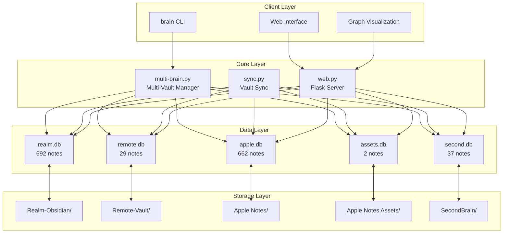
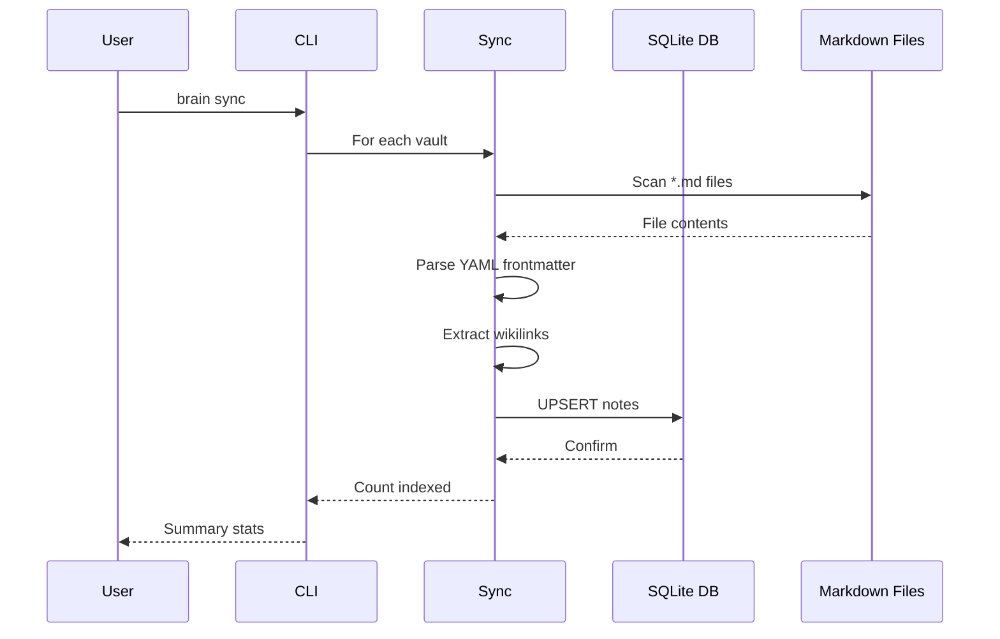
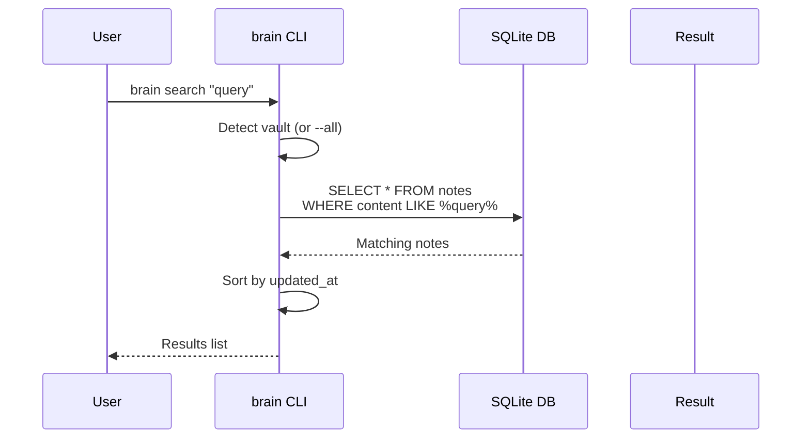
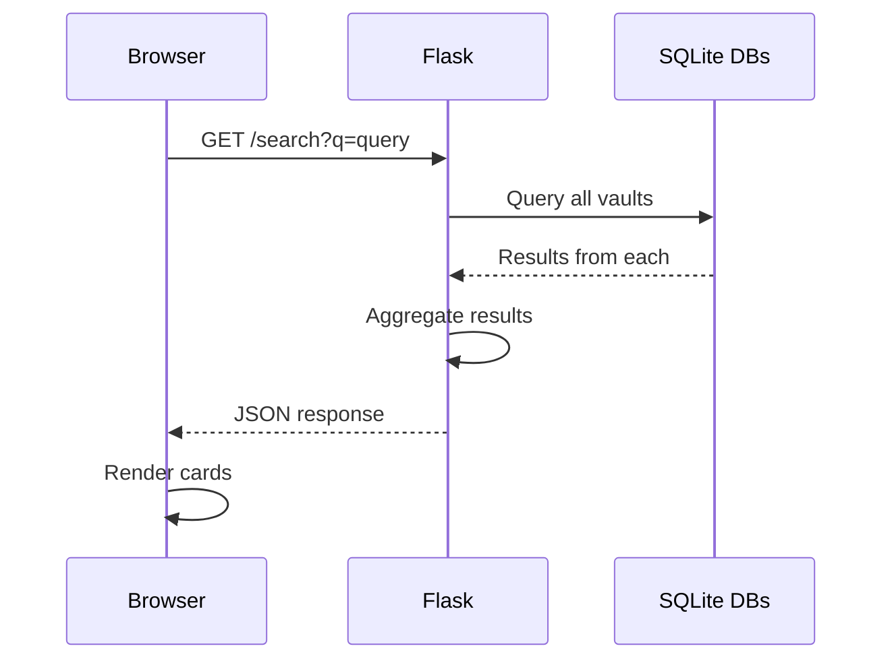

# Architecture

Brain-System is a distributed knowledge management system built around Obsidian vaults with SQLite indexing for instant search and graph visualization.

## System Overview



## Data Flow

### Indexing Flow



### Search Flow



### Web Search Flow



## Database Schema

### Notes Table

```sql
CREATE TABLE notes (
    id TEXT PRIMARY KEY,          -- MD5 hash of file path
    title TEXT,                   -- File name (without .md)
    content TEXT,                 -- Body content (no frontmatter)
    type TEXT,                    -- Note type (optional)
    tags TEXT,                    -- JSON array of tags
    created_at TEXT,              -- ISO timestamp
    updated_at TEXT,              -- ISO timestamp
    para_folder TEXT,             -- PARA category
    yaml_frontmatter TEXT,        -- JSON of frontmatter
    file_path TEXT UNIQUE,        -- Absolute file path
    vault TEXT,                   -- Vault name
    synced INTEGER DEFAULT 0      -- Sync status
);
```

### Links Table

```sql
CREATE TABLE links (
    source_id TEXT,               -- Source note ID
    target_id TEXT,               -- Target note ID
    link_type TEXT DEFAULT 'wikilink',
    created_at TEXT,
    vault TEXT,
    PRIMARY KEY (source_id, target_id, vault)
);
```

### Tasks Table

```sql
CREATE TABLE tasks (
    id TEXT PRIMARY KEY,
    note_id TEXT,                 -- Associated note
    content TEXT,                 -- Task description
    completed INTEGER DEFAULT 0,
    due_date TEXT,
    priority INTEGER DEFAULT 2,   -- 1=high, 2=medium, 3=low
    todoist_id TEXT,              -- External integration
    vault TEXT,
    created_at TEXT,
    FOREIGN KEY (note_id) REFERENCES notes(id)
);
```

## Indexes

```sql
CREATE INDEX idx_notes_type ON notes(type);
CREATE INDEX idx_notes_vault ON notes(vault);
CREATE INDEX idx_notes_tags ON notes(tags);
CREATE INDEX idx_notes_updated ON notes(updated_at);
CREATE INDEX idx_tasks_vault ON tasks(vault);
```

## Vault Detection

The system auto-detects the current vault by traversing up the directory tree:

```python
def _detect_vault(self) -> str:
    cwd = Path.cwd()
    for name, config in VAULTS.items():
        if cwd.is_relative_to(config["path"]):
            return name
    return "realm"  # default
```

## PARA Integration

Notes are automatically categorized into PARA folders:

- **Inbox** - New, unprocessed notes
- **Projects** - Active work with deadlines
- **Areas** - Ongoing responsibilities
- **Resources** - Reference material
- **Archives** - Completed work

Folder detection is case-insensitive and handles variants like `00-Inbox`, `01-Permanent`.

## Graph Visualization

The graph uses **cosmos.gl** for WebGL-accelerated visualization:

### Connection Types

| Type | Description | Color |
|------|-------------|-------|
| wikilink | Direct `[[link]]` | Purple |
| similar | Shared words (Jaccard) | Green |
| tag | Common tags | Orange |
| folder | Same PARA folder | Pink |
| cross-vault | Related across vaults | Violet |

### Graph Algorithm

1. **Point Generation** - Top 800 most connected notes
2. **Wikilink Extraction** - Parse `[[note]]` patterns
3. **Similarity Links** - Word overlap > 5
4. **Tag Clustering** - Connect shared tags
5. **Folder Clustering** - Connect same folder
6. **Force Layout** - Physics-based positioning

## Auto-Sync

LaunchAgent triggers every 5 minutes:

```xml
<key>StartInterval</key>
<integer>300</integer>
<key>Label</key>
<string>com.brain.sync</string>
<key>ProgramArguments</key>
<array>
    <string>/usr/bin/python3</string>
    <string>/Users/gurindersingh/.brain/multi-brain.py</string>
    <string>sync</string>
</array>
```

## Error Handling

- **Missing vaults** - Skip with warning
- **Parse errors** - Log and continue
- **Database locks** - Retry with timeout
- **Invalid YAML** - Store as empty frontmatter

## Security

- Databases stored in vault folders (respects vault permissions)
- Web server binds to 0.0.0.0 (LAN access)
- No external network calls
- File paths are validated before access

## Performance Considerations

- **Search** - Uses `LIKE` with indexes (fast enough for <10K notes)
- **Graph** - Limits to 800 nodes for smooth WebGL rendering
- **Sync** - Batch inserts with transactions
- **Memory** - Row factory for efficient SQLite access

## Extension Points

1. **Custom parsers** - Add support for other file types
2. **Link types** - Add new connection algorithms
3. **Vault plugins** - Extend with vault-specific features
4. **Web routes** - Add new API endpoints
5. **Graph layouts** - Try different force algorithms
