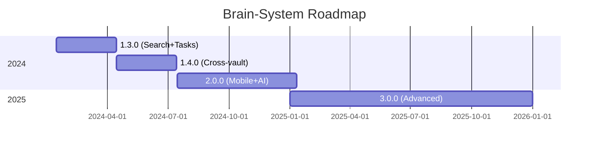

# Feature Roadmap

Planned features and improvements for Brain-System.

## Vision

To create a comprehensive, distributed knowledge management system that seamlessly integrates with Obsidian and provides instant access to your second brain from any device.

## Current Status

### Version 1.2.0 (Released)

- [x] Multi-vault support
- [x] Full-text search
- [x] Graph visualization
- [x] Web interface
- [x] Task management
- [x] Auto-sync via LaunchAgent
- [x] PARA folder detection

---

## Near Term (Q1 2024)

### Version 1.3.0

#### Search Improvements
- [ ] FTS5 full-text search integration
- [ ] Fuzzy search with typo tolerance
- [ ] Search operators (AND, OR, NOT)
- [ ] Search by date range
- [ ] Search history

#### Task Management
- [ ] Task due date notifications
- [ ] Task recurrence
- [ ] Task dependencies
- [ ] Task templates
- [ ] Calendar view for tasks

#### Web Interface
- [ ] Dark/light theme toggle
- [ ] Customizable vault colors
- [ ] Keyboard shortcuts
- [ ] Export search results
- [ ] Print-friendly views

---

## Medium Term (Q2 2024)

### Version 1.4.0

#### Cross-Vault Features
- [ ] Cross-vault backlinks
- [ ] Unified graph across vaults
- [ ] Vault merging/splitting
- [ ] Vault-specific settings

#### Graph Enhancements
- [ ] Multiple layout algorithms
- [ ] Graph filtering by type
- [ ] Graph paths (shortest path between notes)
- [ ] Graph clusters auto-detection
- [ ] Graph export (PNG, SVG)

#### Import/Export
- [ ] Import from Notion
- [ ] Import from Roam Research
- [ ] Export to Markdown bundle
- [ ] Backup/restore functionality
- [ ] Database export to JSON

---

## Long Term (Q3-Q4 2024)

### Version 2.0.0

#### Mobile Support
- [ ] Native iOS app
- [ ] Native Android app
- [ ] Offline mode with sync
- [ ] Biometric authentication
- [ ] Widget for quick access

#### Collaboration
- [ ] Shared vaults
- [ ] Real-time collaboration
- [ ] Comments and discussions
- [ ] Conflict resolution

#### AI Integration
- [ ] Smart note suggestions
- [ ] Auto-tagging
- [ ] Content summarization
- [ ] Question answering
- [ ] Knowledge gap detection

#### Advanced Features
- [ ] Plugin system
- [ ] Custom parsers
- [ ] Webhooks integration
- [ ] API authentication
- [ ] Rate limiting

---

## Future Ideas

### Version 3.0.0 (2025+)

#### Knowledge Graph AI
- [ ] Semantic search with embeddings
- [ ] Auto-linking suggestions
- [ ] Concept extraction
- [ ] Topic modeling
- [ ] Knowledge graph reasoning

#### Enhanced Visualization
- [ ] 3D graph visualization
- [ ] Timeline view
- [ ] Mind map mode
- [ ] Geographic view (for location-tagged notes)
- [ ] VR/AR support

#### Integration Ecosystem
- [ ] Calendar integration (Fantastical, Google Calendar)
- [ ] Task managers (Things, Todoist, Reminders)
- [ ] Reference managers (Zotero, Mendeley)
- [ ] Communication tools (Slack, Discord)
- [ ] File storage (Google Drive, Dropbox)

#### Pro Features
- [ ] End-to-end encryption
- [ ] Self-hosted sync server
- [ ] Team management
- [ ] SSO integration
- [ ] Audit logs

---

## Experimental Ideas

These are exploratory features that may or may not be implemented:

- [ ] Voice search
- [ ] OCR for images in notes
- [ ] Handwriting recognition
- [ ] Real-time collaboration in Obsidian
- [ ] Blockchain-based timestamping
- [ ] Decentralized vault sharing
- [ ] AR note overlays
- [ ] Brain-computer interface (future tech!)

---

## Contributing

Interested in contributing? See [CONTRIBUTING.md](../CONTRIBUTING.md).

Priority areas for community contributions:

1. **Cross-platform support** - Windows, Linux versions
2. **Additional importers** - More tools to import from
3. **Plugins** - Extend functionality
4. **Documentation** - Improve guides and examples
5. **Tests** - Increase test coverage
6. **Translations** - Internationalization

---

## Version Timeline

---

## Feedback

Have ideas or suggestions? Please:

1. Open an issue with `enhancement` label
2. Start a discussion
3. Vote on existing proposals

---

## Changelog

See [CHANGELOG.md](../CHANGELOG.md) for completed features.
